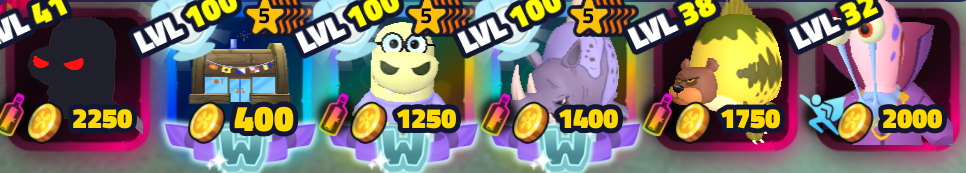

# Spongebob Tower Defense Macro

* **Macro Loader** (`Main.ahk`)
* **Chum Nightmare Macro** (`ChumNightmare.ahk`)
* **Davy Jones Macro** (`DavyJones.ahk`)

Davy jones is still being updated with the resolution so it wont be included at this moment in time

## Download

[Download the latest version](https://github.com/HasB-G/SpongebobTDMacro/releases/latest)

---

## Table of Contents

1. [Requirements](#requirements)
2. [Installation](#installation)
3. [Usage](#usage)
4. [Configuration](#configuration)
5. [License](#license)

## Requirements

* Windows OS
* [AutoHotkey v1.1+](https://www.autohotkey.com/) installed
* use a loadout like the one below


 
This is the one that I have used for all of my macros
* Hash could probably be swapped out for Cyborg

---

## Installation

1. **Download** the latest release
2. **Extract** the zip file
3. **Install** AutoHotkey V1 if you haven’t already.
4. **Run** `Main.ahk` by double-clicking it.

---

## Usage

1. **Start** `Main.ahk`. The loader GUI appears.  
2. **Choose** one of the macros:
   - **Chum Macro** → launches `ChumNightmare.ahk`  
   - **Davy Jones Macro** → launches `DavyJones.ahk`  
3. **Settings** → change your resolution between **1440p** / **1080p**.  
4. **F1** → reopen the loader at any time.

Please make sure you have created a private server!

Camera mode should also be on toggle in roblox settings!

## Menus and what they do

**Setup Menu** used soon as you load into the level

**Choose Level** used when set ups done and you want to replay the macro
(Use when start wave is on screen)

**Go To Challenge** used when first joined the game

**F1 Can be used at anytime to reload the macro and open the menu**
---

## Configuration

The first time you change resolution, `settings.ini` is created:

```ini
[Display]
Resolution=1440p  ; or 1080p
```

Macros read this file at startup to adjust clicks and image regions accordingly.

Macro moving too quick?
  
You could adjust the sleep timings (in ms)

## Updating Images
You will need to update the GameIcon.png if the game is updated, To do this:
* Use Win + Shift + S
* Take a screenshot of the game icon similiar to the one in the images folder
* Replace the image under the same name

## Support me

Send me a gift @NunTooHydrological

[](https://buymeacoffee.com/hasb)

## License

This project is licensed under the **HasB License**. See [LICENSE](LICENSE) for full details.
