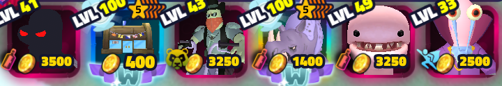

# Spongebob Tower Defense Macro v2.0

**Please read through first**
  
## Download

[Download the latest version](https://github.com/HasB-G/SpongebobTDMacro/releases/latest)

---

## Table of Contents

1. [Requirements](#requirements)
2. [Installation](#installation)
3. [Usage](#usage)
4. [Configuration](#configuration)
5. [License](#license)

## Requirements

* Windows OS
* [AutoHotkey v2.0](https://www.autohotkey.com/) installed
* Created a private server
* Camera mode should also be on toggle in roblox settings
* Camera Sens should be: 0.52
* Game should be maximised (not fullscreen)
* Use a loadout like the one below

 
This is the one that I have used for all of my macros
* Hash could possibly be swapped out for Cyborg
* Rhino could possibly be swapped for a sw 5* Richhard
* Davy Jones and Chum only uses Units 1,2,4,5 the rest can be filler
* Most secrets could probably be swapped for others

---

## Installation

1. **Download** the latest release
2. **Extract** the zip file
3. **Install** AutoHotkey V2 if you haven’t already.
4. **Run** `Main.ahk` by double-clicking it.

---

## Usage

1. **Start** `Main.ahk`. The loader GUI appears
2. **Choose** a gamemode
3. **Choose** an option
4. **F1** → reopen the loader at any time stopping any ongoing macro operations
5. **F2** → Exit the script

## Menus and what they do

**Join Server/Launch Game** Used when out of the game: launches roblox if not already open and joins your private server running the selected mode from then onwards

**Go To Level** Goes to the chosen gamemdoe

**Setup a Level** Can be used when loaded into a level for the first time

**Start a Level** Can be used after setups done e.g. coming back and resuming when start wave is on screen

---

## Configuration

Macro moving too quick?

You could adjust the sleep timings (in ms)

## Notes

Everything is done automatically after makign a selection

In case going to level fails theres checks in place to try again so you could run it 24/7

Any bugs let me know :)

## Support me

Send me a gift @NunTooHydrological

## License

This project is licensed under the **HasB License**. See [LICENSE](LICENSE) for full details.
